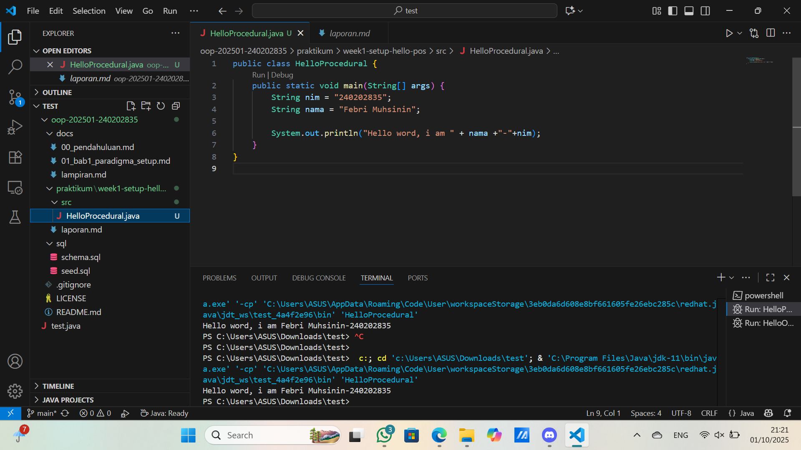
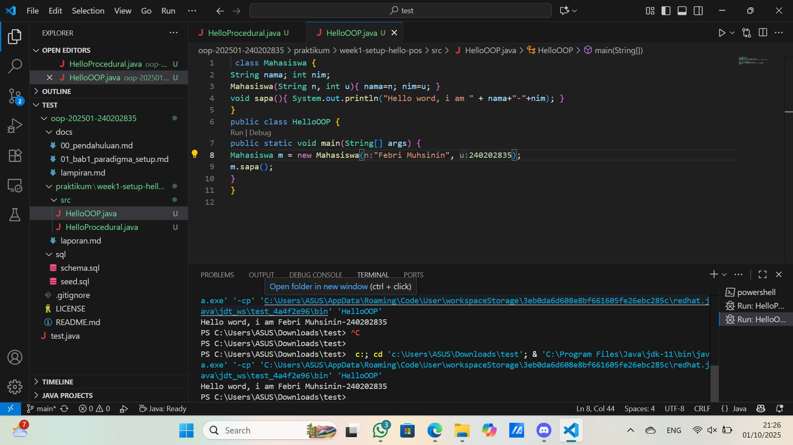
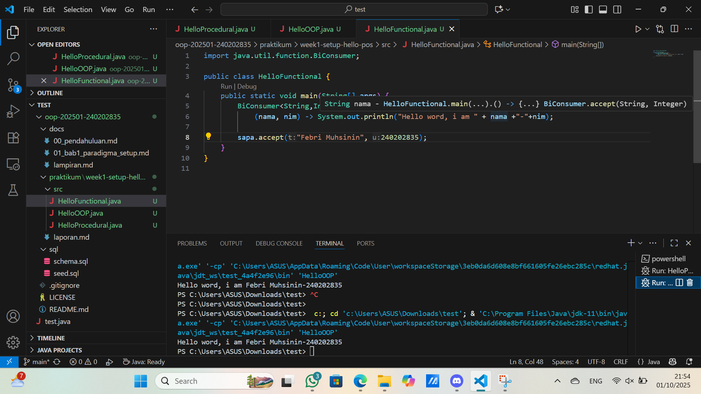

# Laporan Praktikum Minggu 1 (sesuaikan minggu ke berapa?)
Topik: [Paradigma Pemrograman (Prosedural, OOP, dan Fungsional)"]

## Identitas
- Nama  : [Febri Muhsinin]
- NIM   : [240202835]
- Kelas : [3ikra]

---

## Tujuan
1. Mengenal perbedaan cara penulisan program dengan 3 paradigma (prosedural, OOP, fungsional).
2. Membuat program sederhana “Hello World, I am (nama>)-(nim)” dengan 3 cara berbeda.
3. Mengetahui kelebihan dan kekurangan tiap pendekatan.

---

## Dasar Teori  
1. Paradigma Prosedural: Pendekatan pemrograman berbasis langkah-langkah prosedur atau instruksi yang dijalankan secara berurutan.
2. Paradigma OOP (Object-Oriented Programming): Pendekatan pemrograman dengan konsep objek, class, enkapsulasi, inheritance, dan polymorphism.
3. Paradigma Fungsional: Pemrograman berbasis fungsi matematis, menghindari perubahan state, dan lebih menekankan pada penggunaan ekspresi.
4. Perbedaan paradigma membantu programmer memilih metode yang tepat sesuai kebutuhan sistem.
5. Setiap paradigma memiliki kelebihan dan kekurangan dalam hal kompleksitas, skalabilitas, dan keterbacaan kode.

---

## Langkah Praktikum
1. Fork repositori mhbahara/oop-202501 ke akun GitHub pribadi, rename menjadi oop-20251-<nim>, dan clone ke komputer lokal.
2. Membuat file kode program untuk masing-masing paradigma (misalnya: HelloProsedural.java, HelloOOP.java, HelloFungsional.java).
3. Menuliskan kode program sederhana dengan output:

   Hello World, I am (nama)-(nim)

4. Commit hasil coding dengan pesan commit misalnya:

   - git add .
   - git commit -m "upload tugas"
   - git push origin main

---

## Kode Program
1. Procedural
```java
// Contoh
public class HelloProcedural {
   public static void main(String[] args) {
      String nim = "240202835";
      String nama = "Febri Muhsinin";

      System.out.println("Total harga semua produk: " + nama+"-"+ nim);
   }
}
```
2. OOP
```java
// Contoh
public class HelloProcedural {
 class Mahasiswa { 
String nama; int nim; 
Mahasiswa(String n, int u){ nama=n; nim=u; } 
void sapa(){ System.out.println("Hello word, i am " + nama+"-"+nim); } 
} 
public class HelloOOP { 
public static void main(String[] args) { 
Mahasiswa m = new Mahasiswa("Febri Muhsinin", 240202835); 
m.sapa(); 
} 
} 
```
1. Functional
```java
// Contoh
import java.util.function.BiConsumer;

public class HelloFunctional {
    public static void main(String[] args) {
        BiConsumer<String,Integer> sapa =
            (nama, nim) -> System.out.println("Hello word, i am " + nama +"-"+nim);

        sapa.accept("Febri Muhsinin", 240202835);
    }
}
```

---

## Hasil Eksekusi
(Sertakan screenshot hasil eksekusi program.  
1. Procedural
2. OOP
3. Functional
)
---

## Analisis
(
- Prosedural: sederhana dan langsung, cocok untuk program kecil. Kekurangan: sulit dikelola jika program semakin besar.
- OOP: lebih terstruktur karena menggunakan class dan object. Cocok untuk proyek besar, tapi agak panjang untuk program sederhana.
- Fungsional: ringkas dan mudah dibaca jika terbiasa. Namun, bagi pemula lebih sulit dipahami karena konsep lambda/functional interface.
- Perbedaan paling mencolok adalah cara pendekatan: prosedural → instruksi step by step, OOP → berbasis objek, fungsional → berbasis fungsi murni.
)
---

## Kesimpulan
- Paradigma pemrograman memberikan cara pandang berbeda dalam menyelesaikan masalah dengan kode.
- Prosedural cocok untuk program kecil, OOP untuk sistem besar dan kompleks, sedangkan fungsional untuk perhitungan ekspresif dan data processing.
- Dengan memahami ketiga paradigma, mahasiswa dapat memilih pendekatan terbaik sesuai kebutuhan aplikasi.

---

## Quiz
1. [Apakah OOP selalu lebih baik dari prosedural? ]  
   **Jawaban:** … Tidak selalu. OOP bagus untuk aplikasi besar, prosedural lebih simpel untuk program kecil.

2. [Kapan functional programming lebih cocok digunakan
 dibanding OOP atau prosedural? ]  
   **Jawaban:** … Saat butuh pemrosesan data, paralelisme, dan kode ringkas (mis. map/filter/reduce).

3. [Bagaimana paradigma (prosedural, OOP, fungsional) 
memengaruhi maintainability dan scalability aplikasi? ]  
   **Jawaban:** … Prosedural sulit dikelola saat besar, OOP lebih terstruktur dan scalable, fungsional ringkas, reusable, dan cocok untuk sistem paralel.

4. [MengapaOOP lebih cocok untuk mengembangkan
 aplikasi POS dibanding prosedural? ]  
   **Jawaban:** … Karena POS punya banyak entitas (produk, transaksi, pelanggan) yang lebih mudah dimodelkan dengan class dan object.

5. [Bagaimana paradigma fungsional dapat membantu
 mengurangi kode berulang (boilerplate code)? ]  
   **Jawaban:** … Dengan fungsi murni dan higher-order function, logika bisa dipakai ulang tanpa banyak kode berulang.
