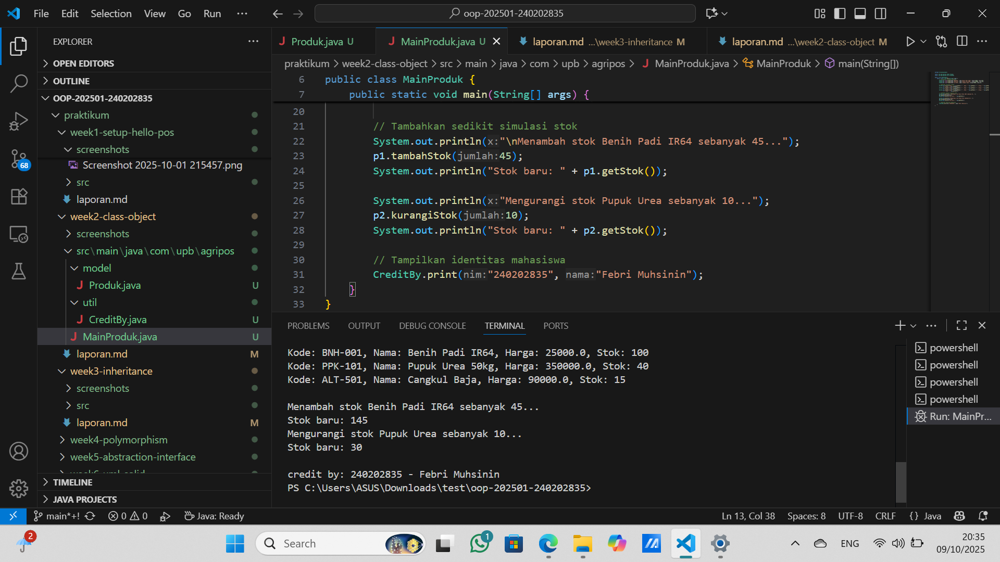

# Laporan Praktikum Minggu 1 (sesuaikan minggu ke berapa?)
Topik: [Class dan Object (Produk Pertanian)]

## Identitas
- Nama  : [Febri Muhsinin]
- NIM   : [240202835]
- Kelas : [3ikra]

---

## Tujuan
(
1. Memahami konsep class, object, atribut, dan method dalam paradigma pemrograman berorientasi objek (OOP).
2. Mampu menerapkan enkapsulasi dengan menggunakan access modifier seperti private dan public.
3. Mampu membuat class Produk untuk merepresentasikan produk pertanian dengan atribut yang sesuai.
4. Mampu melakukan instansiasi objek, menampilkan datanya ke console, dan mencantumkan identitas menggunakan class CreditBy.
5. Menyusun laporan hasil praktikum dengan bukti kode, hasil eksekusi, dan analisis singkat.
)

---

## Dasar Teori
(
1. Class adalah blueprint (cetak biru) dari objek yang berisi definisi atribut dan method.
Misalnya, class Produk berisi atribut seperti nama, harga, dan stok.
2. Object adalah hasil nyata (instansiasi) dari class yang dapat digunakan di program.
Misalnya, Produk p1 = new Produk("BNH-001", "Benih Padi", 25000, 100);
3. Atribut menyimpan data atau karakteristik suatu objek, sedangkan method menentukan perilakunya.
4. Enkapsulasi adalah teknik menyembunyikan data dengan menjadikan atribut private dan menyediakan akses melalui method getter dan setter.
5. Access modifier (public, private, protected) digunakan untuk mengatur tingkat akses terhadap data di dalam class.)

---

## Langkah Praktikum

1. Membuat struktur direktori sesuai panduan:

praktikum/week2-class-object/
├─ src/main/java/com/upb/agripos/model/Produk.java
├─ src/main/java/com/upb/agripos/util/CreditBy.java
├─ src/main/java/com/upb/agripos/MainProduk.java
└─ screenshots/hasil.png


2. Membuat class Produk pada package model dengan atribut: kode, nama, harga, dan stok.

   - Semua atribut diberi modifier private.
   - Menambahkan method getter dan setter.
   - Menambahkan method tambahStok() dan kurangiStok().

3. Membuat class CreditBy di package util untuk menampilkan identitas mahasiswa.

4. Membuat MainProduk untuk menginstansiasi tiga produk pertanian dan menampilkan data di console.

5. Menjalankan program dan memastikan output sesuai.

6. Melakukan commit dengan pesan:

   week2-class-object

---

## Kode Program
(
1. Produk.java
```java
package com.upb.agripos.model;

public class Produk {
    private String kode;
    private String nama;
    private double harga;
    private int stok;

    // Constructor
    public Produk(String kode, String nama, double harga, int stok) {
        this.kode = kode;
        this.nama = nama;
        this.harga = harga;
        this.stok = stok;
    }

    // Getter dan Setter
    public String getKode() { return kode; }
    public void setKode(String kode) { this.kode = kode; }

    public String getNama() { return nama; }
    public void setNama(String nama) { this.nama = nama; }

    public double getHarga() { return harga; }
    public void setHarga(double harga) { this.harga = harga; }

    public int getStok() { return stok; }
    public void setStok(int stok) { this.stok = stok; }

    // Method tambahan untuk stok
    public void tambahStok(int jumlah) {
        this.stok += jumlah;
    }

    public void kurangiStok(int jumlah) {
        if (this.stok >= jumlah) {
            this.stok -= jumlah;
        } else {
            System.out.println("Stok tidak mencukupi!");
        }
    }
}
```
2. CreditBy.java
```java
package com.upb.agripos.util;

public class CreditBy {
    public static void print(String nim, String nama) {
        System.out.println("\ncredit by: " + nim + " - " + nama);
    }
}
```
3. mainProduk.java
```java
package com.upb.agripos;

import com.upb.agripos.model.Produk;
import com.upb.agripos.util.CreditBy;

public class MainProduk {
    public static void main(String[] args) {
        // Instansiasi 3 produk pertanian
        Produk p1 = new Produk("BNH-001", "Benih Padi IR64", 25000, 100);
        Produk p2 = new Produk("PPK-101", "Pupuk Urea 50kg", 350000, 40);
        Produk p3 = new Produk("ALT-501", "Cangkul Baja", 90000, 15);

        // Tampilkan informasi produk
        System.out.println("Kode: " + p1.getKode() + ", Nama: " + p1.getNama() + ", Harga: " + p1.getHarga() + ", Stok: " + p1.getStok());
        System.out.println("Kode: " + p2.getKode() + ", Nama: " + p2.getNama() + ", Harga: " + p2.getHarga() + ", Stok: " + p2.getStok());
        System.out.println("Kode: " + p3.getKode() + ", Nama: " + p3.getNama() + ", Harga: " + p3.getHarga() + ", Stok: " + p3.getStok());

        // Tambahkan sedikit simulasi stok
        System.out.println("\nMenambah stok Benih Padi IR64 sebanyak 45...");
        p1.tambahStok(45);
        System.out.println("Stok baru: " + p1.getStok());

        System.out.println("Mengurangi stok Pupuk Urea sebanyak 10...");
        p2.kurangiStok(10);
        System.out.println("Stok baru: " + p2.getStok());

        // Tampilkan identitas mahasiswa
        CreditBy.print("240202835", "Febri Muhsinin");
    }
}
```
)
---

## Hasil Eksekusi
  


---

## Analisis
(
1. Program ini menggunakan konsep enkapsulasi, di mana atribut Produk disembunyikan (private) dan hanya dapat diakses melalui getter/setter.

2. Dengan menggunakan object, data setiap produk dikelola secara terpisah namun melalui struktur yang sama (class).

3. Method tambahan tambahStok dan kurangiStok membantu dalam pengelolaan stok secara dinamis.

4. Dibanding minggu sebelumnya (yang mungkin masih prosedural), pendekatan OOP ini lebih terstruktur dan mudah dikembangkan karena setiap entitas memiliki tanggung jawab sendiri.

5. Kendala yang dihadapi adalah kesalahan import package pada awalnya, yang diselesaikan dengan memastikan struktur direktori sesuai dengan deklarasi package. 
)
---

## Kesimpulan
(Dengan menerapkan konsep class dan object, program dapat mengelola data produk pertanian secara lebih efisien dan terstruktur.
Penggunaan enkapsulasi menjaga keamanan data, dan konsep ini menjadi dasar penting dalam pengembangan aplikasi berbasis OOP seperti sistem POS.)

---

## Quiz
1. [Mengapa atribut sebaiknya dideklarasikan sebagai private dalam class?]  
   **Jawaban:** …  
   Karena untuk menjaga keamanan data agar tidak diakses atau diubah secara langsung dari luar class. Hal ini mendukung prinsip enkapsulasi.

2. [Apa fungsi getter dan setter dalam enkapsulasi?]  
   **Jawaban:** … 
   Getter digunakan untuk mengambil nilai dari atribut private, sedangkan setter digunakan untuk mengubah nilainya secara terkontrol. 

3. [Bagaimana cara class Produk mendukung pengembangan aplikasi POS yang lebih kompleks?]  
   **Jawaban:** …  
    Dengan membuat class Produk yang terstruktur, pengembang dapat dengan mudah menambahkan fitur baru seperti perhitungan harga, manajemen stok otomatis, atau integrasi dengan database tanpa mengubah logika utama program.
